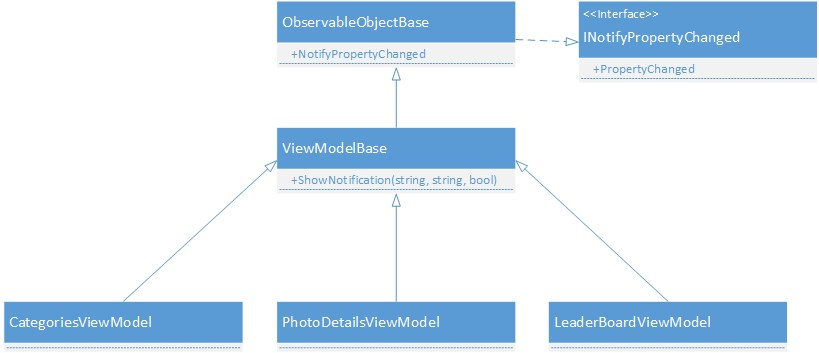
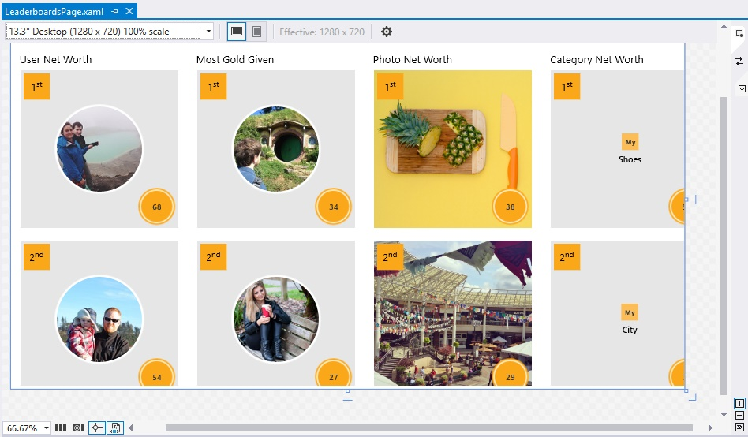
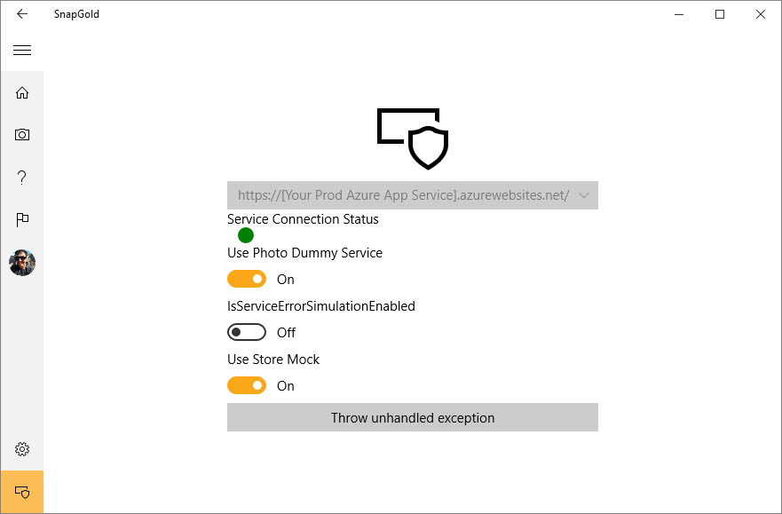

# Technical Deep Dive

Contents:
- [Design Goals](#design-goals)
- [MVVM design pattern](#mvvm)
- [Design ViewModels](#design-viewmodels)
- [Dependency Injection & Registries](#dependency-injection-&-registries)
- [Navigation](#navigation)
- [Navigation bar](#navigation-bar)
- [Service communication](#service-communication)
- [In-app purchase](#in-app-purchase)
- [Authentication](#authentication)

## Design Goals

**PhotoSharingApp** has an architecture that reflects best practices for larger app projects. The following are high-level architectural goals:
- Flexibility: Easy-to-maintain code, allowing components to be easily updated as new capabilities are developed and integrated
- Extensibility: Allowing parts of the app to be easily added or replaced with alternative implementations
- Quality: Allowing services and components to be tested

In order to achieve the above goals, these are the more detailed key design principles:

- The Open/Closed Principle (OCP) - The OCP states that "software entities (classes, modules, functions, and so on) should be open for extension, but closed for modification" (Meyer, Bertrand (1988))
- Separation of concerns (SoC) - The code is divided into distinct features with as little overlap in functionality as possible
- Single Responsibility Principle (SRP) - Each code component should be responsible only for a specific feature or functionality.
- Dependency Inversion Principle (DIP) - This principle states that software modules should not depend on concretions, but on abstractions. In this sample code, interfaces (such as [ICameraEngine](PhotoSharingApp/PhotoSharingApp.Universal/Camera/ICameraEngine.cs#L25), [IPhotoService](PhotoSharingApp/PhotoSharingApp.Universal/Services/IPhotoService.cs#L25)) are being used to hide a specific implementation in order to reduce coupling.
- Don't Repeat Yourself (DRY) - Specific functionality should be implemented in only one place, not duplicated across multiple components. A good example in **PhotoSharingApp** would be the process of making sure that the user is signed in for actions such as uploading photos or posting comments. Doing this check and offering a way to sign in should not be duplicated across the app although it is being used in different places. Therefore, the class [PhotoSharingApp.Universal.Services.AuthEnforcementHandler](PhotoSharingApp/PhotoSharingApp.Universal/Services/AuthEnforcementHandler.cs#L25) which implements [IAuthEnforcementHandler.cs](PhotoSharingApp/PhotoSharingApp.Universal/Services/IAuthEnforcementHandler.cs#L25) takes care of that by offering the method *Task CheckUserAuthentication();*.

More details about the above design principles can be found [here](https://msdn.microsoft.com/library/dn178470%28v=pandp.30%29.aspx#sec11).

## MVVM

**PhotoSharingApp** is based on a clear separation between Views, ViewModels and Models. A separation between those aspects has a couple of advantages:
- Supports design goal of separation of concerns
- Increases application testability
- Natural XAML pattern

For more details on the MVVM pattern and an introduction into Views, ViewModels and Models can be found on [MSDN](https://msdn.microsoft.com/library/hh848246.aspx).

You will find all [Views](PhotoSharingApp/PhotoSharingApp.Universal/Views), [ViewModels](PhotoSharingApp/PhotoSharingApp.Universal/ViewModels) and [Models](PhotoSharingApp/PhotoSharingApp.Universal/Models) located in their respective namespaces within [PhotoSharingApp.Universal](PhotoSharingApp/PhotoSharingApp.Universal).

In **PhotoSharingApp**, binding is initialized in the code-behind of the View (such as [CategoriesPage.xaml.cs](PhotoSharingApp/PhotoSharingApp.Universal/Views/CategoriesPage.xaml.cs#L25)) as follows:

    _viewModel = ServiceLocator.Current.GetInstance<CategoriesViewModel>();
    DataContext = _viewModel;

Throughout the project, ViewModels inherit from [ViewModelBase.cs](PhotoSharingApp/PhotoSharingApp.Universal/ViewModels/ViewModelBase.cs#L25) to get [INotifyPropertyChanged](https://msdn.microsoft.com/library/system.componentmodel.inotifypropertychanged.aspx) support (which is implemented in [ObservableObjectBase.cs](PhotoSharingApp/PhotoSharingApp.Universal/ComponentModel/ObservableObjectBase.cs#L25)) and make use of other shared functionality:

[Models](PhotoSharingApp/PhotoSharingApp.Universal/Models) support the [INotifyPropertyChanged](https://msdn.microsoft.com/library/system.componentmodel.inotifypropertychanged.aspx) interface as well by directly inheriting from [ObservableObjectBase.cs](PhotoSharingApp/PhotoSharingApp.Universal/ComponentModel/ObservableObjectBase.cs#L25).

## Design ViewModels

In the [PhotoSharingApp.Universal.ViewModels.Design](PhotoSharingApp/PhotoSharingApp.Universal/ViewModels/Design) namespace you will find ViewModel classes that are designed to show data at design-time in the Visual Studio Designer. Design-time data helps with the design process of certain pages and does not require running the app in order to verify design changes.

An example of design-time data is in the [LeaderboardDesignViewModel.cs](/PhotoSharingApp/PhotoSharingApp.Universal/ViewModels/Design/LeaderboardDesignViewModel.cs#L25), which provides test data from the dummy service in the Visual Studio Designer:

The XAML page uses DesignInstance to specify the design-time data context as follow:

    d:DataContext="{d:DesignInstance design:LeaderboardDesignViewModel, IsDesignTimeCreatable=True}"

Design-time ViewModels in **PhotoSharingApp** are usually minimalistic to mimic basic UI data for the Visual Studio designer. The following implementation uses the dummy service to display example images:

    namespace Canary.Universal.ViewModels.Design
    {
        /// 

        /// The design-time ViewModel for Leaderboards view.
        /// 

        class LeaderboardDesignViewModel
        {
            public LeaderboardDesignViewModel()
            {
                var service = new PhotoDummyService();
                Leaderboard = service.LeaderboardData;
            }

            public Leaderboard Leaderboard { get; set; }
        }
    }

Design-time data is helpful when creating the UI and its controls while previewing real data to get a feeling of
how the UI looks like at runtime.

## Dependency Injection & Registries

To minimize dependencies between different parts of the application, **PhotoSharingApp** has been designed to make use of interfaces in order to hide the actual implementation. With dependency injection, classes do not directly instantiate other objects that are needed, instead they offer constructors accepting interfaces that allow passing in any valid implementations. In **PhotoSharingApp**, the process of creating those instances is delegated to [Unity](https://msdn.microsoft.com/library/dn223671%28v=pandp.30%29.aspx).

Dependencies are registered and configured in [UnityBootstrapper.cs](/PhotoSharingApp/PhotoSharingApp.Universal/Unity/UnityBootstrapper.cs#L25), which requires registries to implement [IRegistry](/PhotoSharingApp/PhotoSharingApp.Universal/Registries/IRegistry.cs#L25).
With Unity as the dependency container, all dependencies are being resolved automatically.

As part of the app initialization you will find the following in [App.xaml.cs](/PhotoSharingApp/PhotoSharingApp.Universal/App.xaml.cs#L122-L123):

    UnityBootstrapper.Init();
    UnityBootstrapper.ConfigureRegistries();

By calling *Init()*, the UnityBootstrapper class adds available registries to an internal list:

    private static void AddRegistries()
    {
       Registries.Add(new NavigationBarRegistry(Container));
       Registries.Add(new ServicesRegistry(Container));
       Registries.Add(new ViewModelRegistry(Container));
       Registries.Add(new ViewRegistry());
    }

And configures each of these in a second step:

    public static void ConfigureRegistries()
    {
        AddRegistries();
        Registries.ForEach(r => r.Configure());
    }

A registry is a concept of grouping dependency registrations; for example, [ServicesRegistry.cs](/PhotoSharingApp/PhotoSharingApp.Universal/Registries/ServicesRegistry.cs#L25) adds implementations of a number of services to the Unity container:

    public void Configure()
    {
        ...
        Container.RegisterType<INavigationFacade, NavigationFacade>();

        Container.RegisterType<IAuthenticationHandler, AuthenticationHandler>();
        Container.RegisterType<IPhotoService, IntegrationServiceClient>();

        Container.RegisterType<ICameraEngine, CameraEngine>();
        Container.RegisterType<ILicensingFacade, LicensingFacade>();
        ...
    }

UI pages resolve their ViewModels using the ServiceLocator as follows:

    viewModel = ServiceLocator.Current.GetInstance<CategoriesViewModel>(loadData);
    DataContext = viewModel;

Constructor injection is automatically performed with the dependencies registered in Unity:

        public CategoriesViewModel(INavigationFacade navigationFacade, IPhotoService photoService,
            TelemetryClient telemetryClient, IAuthEnforcementHandler authEnforcementHandler)
        {
            _navigationFacade = navigationFacade;
            _photoService = photoService;
            _telemetryClient = telemetryClient;
            _authEnforcementHandler = authEnforcementHandler;
            ...

## Navigation

In **PhotoSharingApp** we follow the [facade pattern](https://msdn.microsoft.com/library/orm-9780596527730-01-04.aspx) for the page navigation and in-app purchases.

The Universal Windows Platform allows page navigation without restricting the actual type of navigation parameters. In a more complex app you might have many-to-one relationships in terms of navigation: For example, you can navigate to the photo details page by clicking on a photo in the photo collection or by clicking on a photo in the featured photos area. In both cases, you would call the *Frame.Navigate(System.Type sourcePageType, object parameter)* method from different places in the code. The fact that the navigation parameter is of type *object* can make it difficult to keep those navigation requests in sync with the target page. Moreover, in the case that a page's navigation parameters need to be adjusted, it can be difficult to track these changes to ensure type safety.

In **PhotoSharingApp**, you will find the INavigationFacade which covers navigation to all available pages and accepts only parameters that those specific pages will actually understand.

    /// 

    /// Navigates to the photo stream view.
    /// 

    /// <param name="category">The category.</param>
    void NavigateToPhotoStream(Category category);

Internally, the [NavigationFacade](/PhotoSharingApp/PhotoSharingApp.Universal/Facades/NavigationFacade.cs#L25) class wraps the given parameter and calls a private *Navigate* method which does serialization if needed, performs the actual navigation and passes the data in form of a (serialized) StreamViewModelArgs instance to StreamPage.

    Navigate(typeof(StreamViewModel), new StreamViewModelArgs(category));

The navigation parameter can then be received as follows in [StreamPage.xaml.cs](/PhotoSharingApp/PhotoSharingApp.Universal/Views/StreamPage.xaml.cs#L93):

    var args = SerializationHelper.Deserialize<StreamViewModelArgs>(e.Parameter as string);

By abstracting navigation and routing every navigation request through INavigationFacade you can make sure that you pass the right parameter to the target page. Implementing the interface, INavigationFacade, will also help once input parameters need to be changed for a page as now each usage of a navigation method in *INavigationFacade* can be traced back to the caller at compile-time.

## Navigation Bar

All items in the navigation bar implement the INavigationBarMenuItem interface and are registered in [NavigationBarRegistry.cs](/PhotoSharingApp/PhotoSharingApp.Universal/Registries/NavigationBarRegistry.cs#L25).

If we look at the example in NavigationBarRegistry, this registry is adding implementations of INavigationBarMenuItem to the Unity container:

    public void Configure()
    {
        // Top items
        Container.RegisterTypeWithName<INavigationBarMenuItem, CategoriesNavigationBarMenuItem>();
        Container.RegisterTypeWithName<INavigationBarMenuItem, CameraNavigationBarMenuItem>();
        Container.RegisterTypeWithName<INavigationBarMenuItem, WelcomeNavigationBarMenuItem>();
        Container.RegisterTypeWithName<INavigationBarMenuItem, LeaderboardNavigationBarMenuItem>();
        Container.RegisterTypeWithName<INavigationBarMenuItem, ProfileNavigationBarMenuItem>();

        // Bottom items
        Container.RegisterTypeWithName<INavigationBarMenuItem, SettingsNavigationBarMenuItem>();
    }

At this point valid implementations of *INavigationBarMenuItem* have been registered, so that those can be resolved in [AppShellViewModel.cs](/PhotoSharingApp/PhotoSharingApp.Universal/ViewModels/AppShellViewModel.cs#L25) using the ServiceLocator as follows:

    NavigationBarMenuItems = ServiceLocator.Current
       .GetAllInstances<INavigationBarMenuItem>()
       .Where( i => i.Position == NavigationBarItemPosition.Top )
       .ToList();

    BottomNavigationBarMenuItems = ServiceLocator.Current
       .GetAllInstances<INavigationBarMenuItem>()
       .Where( i => i.Position == NavigationBarItemPosition.Bottom )
       .ToList();

For example, you want to add a new feedback menu item that allows users to navigate to a feedback page, adding this item into the navigation bar can be done with the following steps:

 1. Add a new class (such as "FeedbackNavigationBarMenuItem") in the PhotoSharingApp.Universal.NavigationBar namespace and implement [INavigationBarMenuItem.cs](/PhotoSharingApp/PhotoSharingApp.Universal/NavigationBar/INavigationBarMenuItem.cs#L25).
 2. Register your new class in [NavigationBarRegistry.cs](/PhotoSharingApp/PhotoSharingApp.Universal/Registries/NavigationBarRegistry.cs#L25):

    Container.RegisterTypeWithName<INavigationBarMenuItem, FeedbackNavigationBarMenuItem>();

## Service communication

Communication between the app and service is handled in the Services namespace. IPhotoService is the central part which defines all available service calls. By abstracting service calls behind the IPhotoService interface, you can easily switch between a dummy service which serves static data for exploring purposes and a real hosted service implementation, such as an [Azure App Service](https://azure.microsoft.com/services/app-service/).

IPhotoService provides all methods that are needed with respect to retrieving and uploading data to the service.

    interface IPhotoService
    {
        /// 

        /// Uploads the photo.
        /// 

        /// <param name="stream">The memory stream.</param>
        /// <param name="localPath">The local path.</param>
        /// <param name="caption">The caption.</param>
        /// <param name="categoryId">The id of the assocaited category.</param>
        /// <returns>The uploaded photo.</returns>
        Task<Photo> UploadPhoto(Stream stream, string localPath, string caption, string categoryId);

        /// 

        /// Gets the photo details for the given photo id.
        /// 

        /// <param name="photoId">The photo identifier.</param>
        /// <returns>The photo.</returns>
        Task<Photo> GetPhotoDetails(string photoId);
        ...

In **PhotoSharingApp**, *IPhotoService* is mainly used by ViewModels to interact with the service.  The abstraction behind an interface allows easily replacing this service with an alternative implementation or switching between different implementations at runtime from the DebugPage.xaml. [ServiceClient.cs](/PhotoSharingApp/PhotoSharingApp.Universal/Services/ServiceClient.cs#L25) is the implementation that is used to communicate with an Azure App Service, while *PhotoDummyService* is the implementation that shows static test data:

### Contract Models Conversions

In *PhotoSharingApp.Portable* you will find data contracts that are used by the app to communicate to the service. These classes have the single purpose, to make sure the app and service agree on the same contracts, therefore they are very lightweight.

Besides storing data, data models in an app can offer helper methods, additional properties which do formatting or implement [INotifyPropertyChanged](https://msdn.microsoft.com/library/system.componentmodel.inotifypropertychanged.aspx) to support data binding. Therefore, in this example, the app's data model is different from the data that is transferred between service and app.

To give an example, the [CategoryContract.cs](/PhotoSharingApp/PhotoSharingApp.Portable/DataContracts/CategoryContract.cs#L25) class simply contains two properties for the *Id* and *Name*:

    /// 

    /// The category data contract.
    /// 

    public class CategoryContract
    {
        /// 

        /// The category Id.
        /// 

        public string Id { get; set; }

        /// 

        /// The category name.
        /// 

        public string Name { get; set; }
    }

The [Category.cs](/PhotoSharingApp/PhotoSharingApp.Universal/Models/Category.cs#L25) class provides data binding functionality as well as an additional *HasErrors* property for input validation:

    /// 

    /// Represents a category.
    /// 

    public class Category : ObservableObjectBase
    {
        private string _id;
        private string _name;

        /// 

        /// Gets the data model validation result.
        /// Returns true, if it contains one or more errors.
        /// Otherwise, false.
        /// 

        public bool HasErrors
        {
            get
            {
                return string.IsNullOrWhiteSpace(_name)
                       || _name.Length < 2
                       || _name.StartsWith("my", StringComparison.CurrentCultureIgnoreCase);
            }
        }

        /// 

        /// Gets or sets the Id.
        /// 

        public string Id
        {
            get { return _id; }
            set
            {
                if (value != _id)
                {
                    _id = value;
                    NotifyPropertyChanged();
                }
            }
        }

        /// 

        /// Gets or sets the name.
        /// 

        public string Name
        {
            get { return _name; }
            set
            {
                if (value != _name)
                {
                    _name = value;
                    NotifyPropertyChanged();

                    // The name has changed, so we need to update the
                    // object's validation status.
                    NotifyPropertyChanged(() => HasErrors);
                }
            }
        }
    }

Conversion methods can be found in the *PhotoSharingApp.Universal.ContractModelConverterExtensions* namespace. A conversion from data model to data contract is usually performed when data is sent to the service, a conversion from data contract to data model when data is received from the service.

## In-app purchase

In-app purchases in **PhotoSharingApp** have two abstraction layers:
- [CurrentAppProxy.cs](/PhotoSharingApp/PhotoSharingApp.Universal/Store/CurrentAppProxy.cs#L25) acts as a [proxy](https://en.wikipedia.org/wiki/Proxy_pattern) to allow switching between Windows.ApplicationModel.Store.CurrentApp and Windows.ApplicationModel.Store.CurrentAppSimulator.
- [ILicensingFacade.cs](/PhotoSharingApp/PhotoSharingApp.Universal/Facades/ILicensingFacade.cs#L24) acts as a [facade](https://msdn.microsoft.com/library/orm-9780596527730-01-04.aspx) on top of CurrentAppProxy. The motivation for this design is that purchasing gold includes multiple steps: Check if user is signed in, perform purchase using Windows.ApplicationModel.Store.CurrentApp and notify **PhotoSharingApp** service to increase the user's gold count. Additionally, you may want to track any purchase requests by telemetry.

As you can see there are multiple processes involved to perform a gold purchase which may be triggered by different parts in the app. With that in mind in-app purchases are being routed through ILicensingFacade similar to INavigationFacade.
